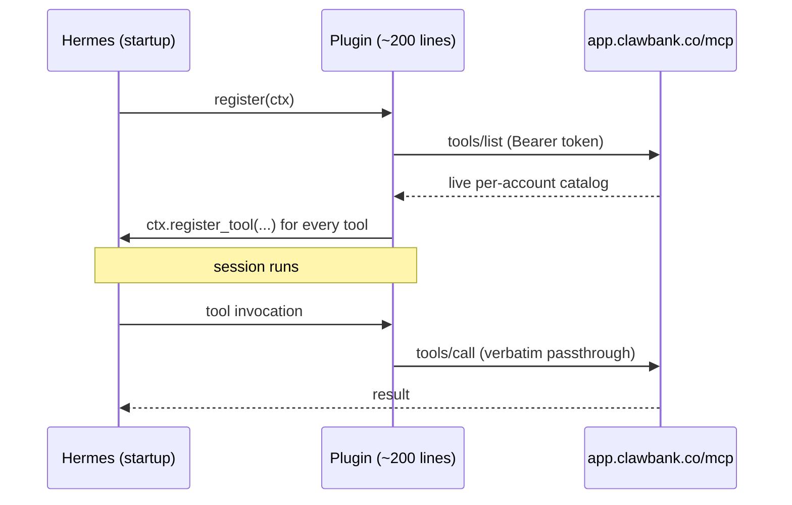

<div align="center">

# 🦞 ClawBank for Hermes

**Economic agency for Hermes agents — hold assets, pay, trade, buy x402 services, and cut enforceable deals.**

[](https://github.com/ClawBank-co/clawbank-hermes-plugin/actions/workflows/ci.yml)
[](LICENSE)


[Install](#install) · [Verify](#verify-the-install) · [What your agent can do](#what-your-agent-can-do) · [How it works](#how-it-works) · [Safety](#safety-model) · [Troubleshooting](#troubleshooting) · [ClawBank docs](https://app.clawbank.co/docs)

</div>

---

[ClawBank](https://clawbank.co) is crypto-native financial infrastructure built for AI agents: custodial USD/USDC bank rails, a self-custody wallet on Base and the XRP Ledger, token trading, x402 pay-per-request commerce, escrowed token deals, milestone contracts, and US business formation.

This plugin connects all of it to [Hermes](https://github.com/NousResearch/hermes-agent). It is a **dynamic catalog proxy**: at startup it fetches the live tool catalog from the ClawBank MCP API and registers every tool with Hermes. No tool definitions live in this repo — when ClawBank ships a new capability, your agent has it on the next launch, with zero plugin updates.

## Install

```bash
hermes plugins install ClawBank-co/clawbank-hermes-plugin --enable
```

That's the whole thing — Hermes installs plugins straight from GitHub into `~/.hermes/plugins/`. There is no registry, approval step, or waiting period.

Hermes prompts for your `CLAWBANK_API_TOKEN` during install (input is masked; the value is saved to your `.env`):

1. Create a free account at [app.clawbank.co/users/register](https://app.clawbank.co/users/register)
2. Mint a token under **Settings → API tokens** ([app.clawbank.co/users/settings](https://app.clawbank.co/users/settings))

## Verify the install

Start `hermes` — the banner's tool list should show the `clawbank` toolset. Then, in order:

1. **Catalog loaded.** Type `/plugins` in-session. You should see `clawbank` with a large tool count (the exact number is per-account; ~150–200 for a typical account). If it shows exactly **1 tool**, the catalog didn't load and you got the `clawbank_setup` fallback — ask the agent to call it and it will tell you why (missing token, rejected token, or API unreachable).
2. **Read path works.** Try a read-only prompt — no funds move:

   > *Show me my ClawBank balances.*
   >
   > *What's my ClawBank wallet address on Base?*
   >
   > *Get me a quote to swap $50 of USDC for CLAWBANK — don't execute.*
   >
   > *List my open ClawBank deals.*

3. **Skill registered.** Ask the agent to run `skill_view("clawbank:clawbank")` — it should load the bundled ClawBank skill (capability map, confirmation rules, safety invariants). Plugin skills are opt-in explicit loads; they don't appear in the system prompt's skill index, so this is the way to pull the guidance into a session.

Good to know:

- **New tools appear on restart, not mid-session.** The catalog is fetched once per Hermes launch. When ClawBank ships new capabilities, restart Hermes to pick them up — no plugin update needed.
- **Token rotation.** If you revoke/rotate your token, update `CLAWBANK_API_TOKEN` in the environment (or `.env`) and restart. Mid-session, a revoked token doesn't crash anything — tool calls return a clear error with re-mint instructions.
- **Offline starts are fine.** The last successful catalog is cached next to the plugin (`.catalog.json`), so a flaky network at startup still registers the full toolset.

## What your agent can do

| Area | Capabilities |
| --- | --- |
| **Accounts & money** | USD virtual account deposits, custodial USDC balance, off-ramp to a US bank |
| **Self-custody wallet** | Turnkey-backed wallet on Base + XRPL: send USDC and any ERC-20, sign transactions, trace deposits, bridge Base ⇄ XRPL |
| **Wise** | International transfers: quotes, recipients, multi-currency balances |
| **Trading** | Spot swaps via 0x and recurring strategies (DCA, rebalancing, momentum) with positions, PnL, and audit logs |
| **x402 commerce** | Discover and purchase pay-per-request services (data, inference, search) under user-set budgets |
| **Deals** | Escrowed token claims with one-time codes, linear vesting, and KPI-gated unlocks |
| **Contracts** | DocuSign agreements between ClawBank users, optionally with on-chain USDC milestone payouts |
| **Formation** | Form and manage US LLCs; company record books and governance history |
| **Coms** | Agent-to-agent email and IM, plus MoltBook registration |
| **Fight Clubs** | DAO membership, proposals, voting, and treasury actions |

The catalog is **per-account**: `tools/list` returns exactly what your token's account can call, so gated capabilities never clutter your agent's context.

## How it works



Design principles, in order of importance:

- **Zero maintenance.** The plugin is a transport shim. Tools, schemas, descriptions, gating, and safety language all live server-side and are inherited automatically — the same proven model as ClawBank's [Claude Desktop connector](https://app.clawbank.co/docs/mcp) and [CLI](https://www.npmjs.com/package/clawbank-cli), neither of which has ever needed an update for a new platform capability.
- **One generic handler.** Every tool handler is the same closure: serialize args → `tools/call` → return the result. There is no per-tool code anywhere.
- **Graceful degradation.** The last successful catalog is cached on disk, so a flaky network at startup still yields a working toolset. With no token (or a revoked one), the plugin registers a single `clawbank_setup` tool that explains how to connect — it never fails the Hermes launch.
- **Zero dependencies.** Python standard library only. The entire auditable surface is two small modules.

A bundled skill (`skills/clawbank/`) teaches the agent judgment: when to quote instead of execute, what requires explicit user confirmation, and the invariants that keep funds safe. Load it in-session with `skill_view("clawbank:clawbank")`.

## Configuration

| Variable | Purpose | Default |
| --- | --- | --- |
| `CLAWBANK_API_TOKEN` | API token (prompted at install) | — |
| `CLAWBANK_TOKEN` | Token fallback, for parity with the ClawBank CLI | — |
| `CLAWBANK_MCP_URL` | MCP endpoint override | `https://app.clawbank.co/mcp` |

## Safety model

- **Server-side first.** Fund-moving tools carry their safety language in their own descriptions (e.g. *"MOVES FUNDS OUT — always confirm the token, amount, and destination with the user first"*). Strengthening them server-side upgrades every client at once.
- **The skill is the judgment layer.** It enforces a confirmation contract for anything that moves value — restate asset, amount, destination, and network, then wait for an explicit yes — plus invariants like *never infer a wallet address* and *blockchain finality is real*. See [`skills/clawbank/references/safety.md`](skills/clawbank/references/safety.md) for the full matrix.
- **Tokens are full-access.** ClawBank API tokens have no scopes; treat them like a bank password. They are revocable at any time under Settings → API tokens.

## Troubleshooting

**The plugin doesn't appear at all.** Plugins are opt-in. Run `hermes plugins list` to see the discovered name, then `hermes plugins enable clawbank`. The layout must be `~/.hermes/plugins/<name>/plugin.yaml` — flat, or at most one category level deep.

**It appears but won't load.** Get verbose discovery logs with:

```bash
HERMES_PLUGINS_DEBUG=1 hermes plugins list
```

This prints, per plugin, what was scanned, why anything was skipped, and a full traceback if `register(ctx)` raised. The same detail lands in `~/.hermes/logs/agent.log` (`hermes logs --level WARNING | grep -i clawbank`). A plugin load failure never takes Hermes down — the plugin is just marked errored.

**Only `clawbank_setup` is registered.** The catalog couldn't load. The setup tool's output states the exact reason:

| Reason | Fix |
| --- | --- |
| `no_token` | Set `CLAWBANK_API_TOKEN` and restart Hermes |
| `invalid_token` | The token was rejected (revoked or mistyped) — re-mint at [Settings → API tokens](https://app.clawbank.co/users/settings) |
| `unreachable` | The API couldn't be reached and no cached catalog exists yet — check connectivity and `curl https://app.clawbank.co/mcp` (public health check, no auth) |

**A capability area is missing (no Wise / Trading / Formation tools).** Not a bug. The catalog is per-account — the server only returns tools your account can actually call. Gated areas appear once they're enabled for your account, on the next restart.

**Tool calls fail mid-session with an auth error.** The token was revoked after startup. Calls return `{"error": ..., "hint": ...}` instead of crashing; update the token and restart.

**Quick end-to-end sanity check outside Hermes.** From a clone of this repo:

```bash
python scripts/live_check.py          # health + auth-rejection shape (no token needed)
CLAWBANK_TEST_TOKEN=<token> python scripts/live_check.py   # + loads your real catalog
```

## Development

```bash
pip install pytest ruff
pytest tests      # mock MCP endpoint: catalog load, SSE parsing, fallbacks, dispatch
ruff check .      # lint
python scripts/live_check.py   # optional: verify the live surface shape
```

```
clawbank-hermes-plugin/
├── plugin.yaml            # manifest (tools are discovered, not declared)
├── __init__.py            # register(ctx): fetch catalog → register tools + skill
├── client.py              # JSON-RPC over HTTP, Bearer auth, SSE parsing, catalog cache
├── skills/clawbank/       # SKILL.md + setup / safety / examples references
├── tests/                 # mock-endpoint test suite
├── scripts/live_check.py  # scheduled drift alarm against the live API
└── .github/workflows/     # CI + weekly live-surface check
```

## Questions or problems?

- **Email:** [justice@clawbank.co](mailto:justice@clawbank.co)
- **GitHub:** [open an issue](https://github.com/ClawBank-co/clawbank-hermes-plugin/issues)
- **X:** [@singularityhack](https://x.com/singularityhack) (builder) · [@ClawBankHQ](https://x.com/ClawBankHQ) (ClawBank)
- **Rabbit hole:** the [ClawBank blog](https://clawbank.co/blog.html) — longer-form notes on the product and platform

## License

[MIT](LICENSE) — © ClawBank
